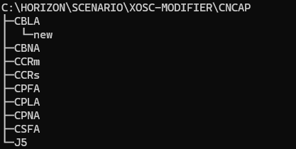

# Xosc-modifier
## Info
Author: Harvey Miao  
Python Version: 3.8.15  
概括: 基于Openscenario 1.x协议，对已有的场景文件进行批量修改或泛化  
## 支持功能
### 批量修改
1. 主车速度
2. 结束触发器
3. 对手车模型
4. 主车模型
### 场景泛化
1. 主车速递
2. 偏置率（仅限C2C场景）
## 使用说明
1. 首先把51simone中导出的场景文件解压缩  
支持如下图所示的文件夹树结构  

2. 运行 ``python3 modifier.py`` 或打开目录下的modifier.exe
## 使用示例
### 示例1
目标：批量修改